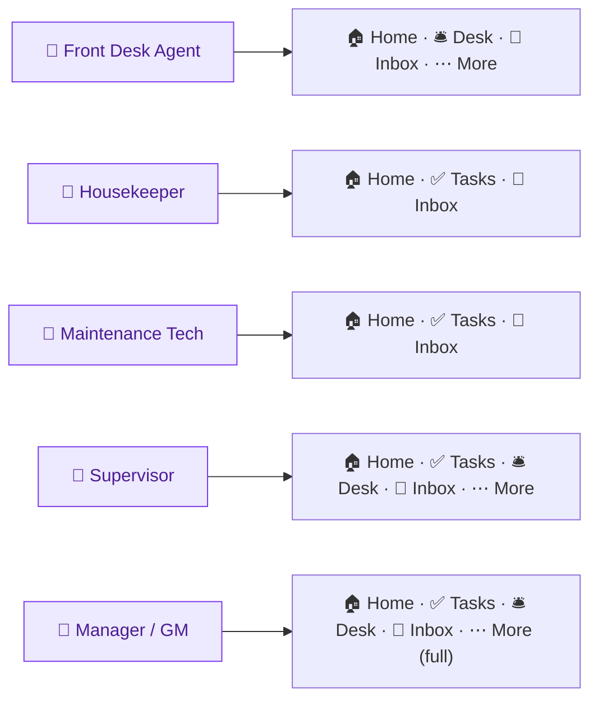
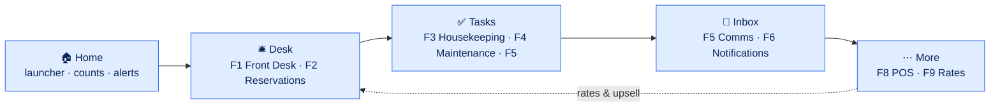

# Atrium Staff — Mobile App Navigation & Feature Map

**Product:** Atrium Staff (Hotel / Resort Operations Mobile App)
**Document owner:** rdasgupta@apexdmit.com
**Last updated:** 2026-07-14
**Status:** Draft v1.0
**Supporting detail:** [Feature Deep-Dives Index](staff-mobile-app-feature-deep-dives-index.md) · [Feature Prioritization](staff-mobile-app-feature-prioritization.md) · [Executive Summary](staff-mobile-app-executive-summary.md)

This document shows **where each in-scope feature is implemented from the mobile app's perspective** — the navigation shell, the bottom tab bar, the screens under each tab, and the cross-cutting layers. It is the information-architecture (IA) view, not a visual UI mockup.

> **Scope note:** **F7 Dashboards/Reporting/Analytics was removed** — the Home tab is now a lightweight **operational launcher** (counts + alerts + quick actions), not KPIs/reports. F4 is **reactive work orders** (no PM/asset history), F8 is **F&B core POS** (no spa/golf/retail), F9 is **manual rates + channel sync** (no automated pricing). Multi-property, lost & found, shift/attendance, and concierge tasks are out of scope.

> Diagrams below use **Mermaid**. They render in GitHub and in VS Code with a Mermaid preview extension. A text feature-to-screen table follows each diagram as a fallback.

---

## 1. App structure at a glance

The app is a single shell: **Login → Home launcher → 5-tab bottom bar**, with **Notifications (F6)** and **Offline sync** as global layers present on every screen.

```mermaid
flowchart TB
  L["🔐 Login / Auth<br/>SSO · PIN · Biometric · RBAC · Offline session"]:::auth
  L --> BAR{{"📱 Bottom Tab Bar — role-based"}}:::bar

  BELL["🔔 Notifications<br/>global overlay · F6"]:::global
  SYNC["📶 Offline + Auto-sync<br/>global layer"]:::global
  BELL -.present on every screen.-> BAR
  SYNC -.present on every screen.-> BAR

  BAR --> HOME["🏠 Home"]:::tab
  BAR --> TASKS["✅ Tasks"]:::tab
  BAR --> DESK["🛎️ Desk"]:::tab
  BAR --> INBOX["💬 Inbox"]:::tab
  BAR --> MORE["⋯ More"]:::tab

  %% HOME
  HOME --> H1["Today launcher<br/>counts · alerts · quick actions"]
  H1 -.implements.-> SHELL["App shell (not analytics)"]:::feat

  %% TASKS
  TASKS --> TK1["My Tasks · SLA timers"]
  TASKS --> TK2["Housekeeping room board<br/>Clean/Dirty/Inspected · assignments"]
  TASKS --> TK3["Maintenance work orders<br/>reactive · photos"]
  TK1 -.implements.-> F5a["F5 Task Management"]:::feat
  TK2 -.implements.-> F3a["F3 Housekeeping"]:::feat
  TK3 -.implements.-> F4a["F4 Maintenance (reactive)"]:::feat

  %% DESK
  DESK --> D1["Arrivals / Departures / In-house"]
  DESK --> D2["Check-in / out · Folio<br/>Payment · Key encoding"]
  DESK --> D3["Reservations calendar<br/>Create/Edit · Blocks · Pay-by-link"]
  D1 -.implements.-> F1a["F1 Front Desk"]:::feat
  D2 -.implements.-> F1a
  D3 -.implements.-> F2a["F2 Reservations"]:::feat

  %% INBOX
  INBOX --> I1["Staff messaging<br/>1:1 · group · department"]
  INBOX --> I2["Notification history · broadcasts"]
  I1 -.implements.-> F5b["F5 Internal Comms"]:::feat
  I2 -.implements.-> F6a["F6 Notifications"]:::feat

  %% MORE
  MORE --> M1["POS & Outlets<br/>F&B tableside · charge-to-room"]
  MORE --> M2["Rates & Channels<br/>manual rates · channel sync"]
  MORE --> M3["Guest profiles · Settings"]
  M1 -.implements.-> F8a["F8 POS (F&B core)"]:::feat
  M2 -.implements.-> F9a["F9 Rates (manual)"]:::feat

  classDef auth fill:#1f2a44,color:#fff,stroke:#101828;
  classDef bar fill:#2563eb,color:#fff,stroke:#1e40af;
  classDef tab fill:#e0ecff,color:#0b2559,stroke:#2563eb;
  classDef feat fill:#fef3c7,color:#7a4f01,stroke:#d97706;
  classDef global fill:#dcfce7,color:#14532d,stroke:#16a34a;
```

---

## 2. Feature → screen implementation map (text fallback)

| Feature | Primary location (tab → screen) | Secondary touchpoints |
|---------|--------------------------------|-----------------------|
| **F1 Front Desk** | 🛎️ Desk → Check-in/out · Folio · Payment · Key | Desk → Arrivals/Departures; deep-links from 🔔 & Home |
| **F2 Reservations** | 🛎️ Desk → Reservations calendar · Create/Edit · Blocks · Pay-by-link | 🔔 booking alerts; More → Guest profiles |
| **F3 Housekeeping** | ✅ Tasks → Room board · Assignments · Checklists/QA | Home (dirty-room count); Desk (room-ready status) |
| **F4 Maintenance (reactive)** | ✅ Tasks → Work orders (log/assign/close, photos) | Desk (OOO status); 🔔 escalations |
| **F5 Task Mgmt & Comms** | ✅ Tasks → My Tasks · 💬 Inbox → Messaging | Cross-links from every module (raise a task) |
| **F6 Notifications** | 🔔 Global overlay + 💬 Inbox → History | Deep-links into F1–F5/F8/F9 screens |
| **F8 POS (F&B core)** | ⋯ More → POS & Outlets (F&B tableside) | Charge-to-room posts to F1 folio |
| **F9 Rates (manual)** | ⋯ More → Rates & Channels | Home (pace/RevPAR at-a-glance); Desk (rate context) |
| **🏠 Home** | Today launcher (counts, alerts, quick actions) | App shell — not analytics/reporting |

**Cross-cutting (every screen):** 🔐 Auth/RBAC · 🔔 Notifications (F6) · 📶 Offline + auto-sync · guest/room/folio context.

---

## 3. Role-based navigation (who sees which tabs)

RBAC controls not just data but which tabs and screens appear. The bottom bar adapts to the signed-in role.

| Tab / Module | Front Desk | Housekeeper | Maintenance | Supervisor | Manager / GM |
|--------------|:---------:|:-----------:|:-----------:|:----------:|:------------:|
| 🏠 Home (launcher) | ✅ | ✅ | ✅ | ✅ | ✅ |
| ✅ Tasks (F3/F4/F5) | Guest requests | Room board | Work orders | Assign/monitor | Assign/monitor |
| 🛎️ Desk (F1/F2) | ✅ Full | — | — | ✅ | ✅ |
| 💬 Inbox (F5/F6) | ✅ | ✅ | ✅ | ✅ | ✅ |
| ⋯ More → POS (F8) | View/charge | — | — | ✅ | ✅ |
| ⋯ More → Rates (F9) | — | — | — | View | ✅ Full |

---

## 4. How the tabs map to the operational flow

The tabs mirror the operating loop: **sell the room (Desk) → make it ready (Tasks) → coordinate (Inbox) → optimize the money (More)**, with **Home** as the at-a-glance launcher.

- **Home → Desk:** the launcher's counts/alerts jump straight into arrivals and check-in.
- **Desk → Tasks:** a checkout releases the room; housekeeping/maintenance turn it (room-ready & OOO flags sync back to Desk).
- **Tasks → Inbox:** cross-department work is routed and coordinated; alerts keep it timely.
- **Inbox → More:** rate (F9) and outlet/upsell (F8) decisions feed back into what the Desk sells.

---

## 5. Key user journeys (screen path)

**Arrival with upsell (Front Desk Agent):**
`🔔 arrival alert → 🛎️ Desk / Arrivals → tap guest → Check-in → upsell prompt (F1) → Payment → Key → done`

**Room turn (Housekeeper):**
`✅ Tasks / Room board → assigned room → checklist (F3) → mark Clean → Supervisor inspects → room-ready alert to 🛎️ Desk`

**Repair (Maintenance Tech):**
`🔔 work-order alert → ✅ Tasks / Work orders → accept → log parts/photos (F4) → complete → room returns to service (Desk)`

**Manager rate check (GM):**
`🏠 Home → counts/alerts → ⋯ More / Rates & Channels → manually adjust rate + channel sync (F9)`

---

## 6. Implementation phasing on the navigation shell

The shell ships first; features light up their screens by phase (aligned to the [Feature Prioritization](staff-mobile-app-feature-prioritization.md)).

| Phase | Tabs/screens activated | Features |
|-------|------------------------|----------|
| **P1 — Spine** | Auth, 🏠 Home launcher, 🛎️ Desk (core), ✅ Tasks (room board), 🔔 basic | F1, F3 |
| **P2 — Flow** | 🛎️ Desk (Reservations), ✅ Tasks (reactive work orders), 🔔 full | F2, F4, F6 |
| **P3 — Coordinate** | 💬 Inbox | F5 |
| **P4 — Revenue upside** | ⋯ More (F&B POS, manual Rates) | F8, F9 |

---

## 7. Notes

- **One shell, many roles.** RBAC hides/shows tabs and screens; the codebase is one app.
- **Home is a launcher, not a dashboard.** F7 dashboards/reporting/analytics were removed from scope; Home shows operational counts, alerts, and quick actions only.
- **Notifications & offline are layers, not tabs.** They wrap every screen rather than living in one place.
- **Charge-to-room is the connective thread.** F8 (POS) and F1 (folio) read/write the same guest folio; F9 rate changes sync to channels.
- This is the **IA/navigation** view. A visual phone-frame mockup can be produced as a shareable Artifact on request.
