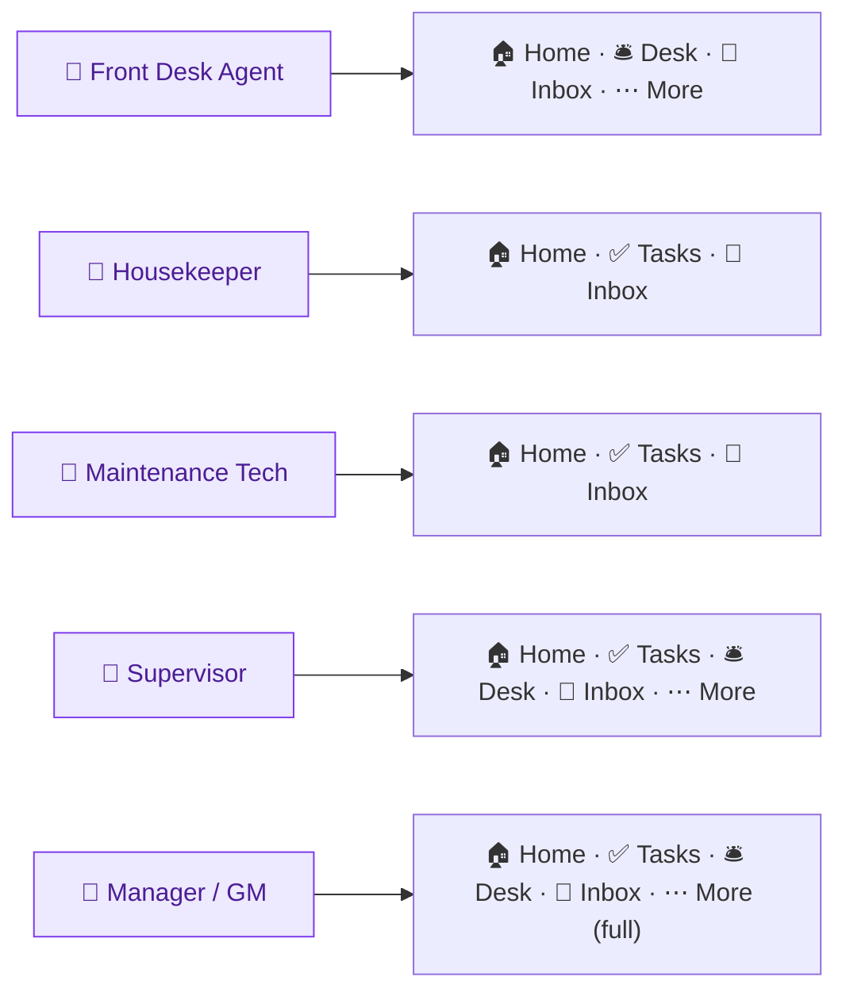
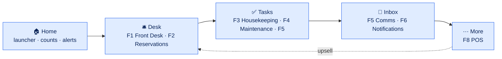

# Atrium Staff — Mobile App Navigation & Feature Map

**Product:** Atrium Staff (Hotel / Resort Operations Mobile App)
**Document owner:** rdasgupta@apexdmit.com
**Last updated:** 2026-07-14
**Status:** Draft v1.0
**Start here:** [Overview & Index](../overview.md)
**Supporting detail:** [Feature Prioritization](staff-mobile-app-feature-prioritization.md) · [Executive Summary](staff-mobile-app-executive-summary.md) · [Role-Based Design](staff-mobile-app-role-based-design.md)

This document shows **where each feature is implemented from the mobile app's perspective** — the navigation shell, the bottom tab bar, the screens under each tab, and the cross-cutting layers. It is the information-architecture (IA) view, not a visual UI mockup.

> Diagrams below use **Mermaid**. They render in GitHub and in VS Code with a Mermaid preview extension. A text feature-to-screen table follows each diagram as a fallback.

---

## 1. App structure at a glance

The app is a single shell: **Login → Home launcher → 5-tab bottom bar**, with **Notifications (F6)**, **Offline sync**, and **Staff SOS (F16)** as global layers present on every screen. The extended features (F9–F18) live mostly under **✅ Tasks** and **⋯ More** (with **F17** scanning surfaced *inside* existing screens rather than a tab), keeping the five-tab shell unchanged.

```mermaid
flowchart TB
  L["🔐 Login / Auth<br/>SSO · PIN · Biometric · RBAC · Offline session"]:::auth
  L --> BAR{{"📱 Bottom Tab Bar — role-based"}}:::bar

  BELL["🔔 Notifications<br/>global overlay · F6"]:::global
  SYNC["📶 Offline + Auto-sync<br/>global layer"]:::global
  BELL -.present on every screen.-> BAR
  SYNC -.present on every screen.-> BAR

  BAR --> HOME["🏠 Home"]:::tab
  BAR --> TASKS["✅ Tasks"]:::tab
  BAR --> DESK["🛎️ Desk"]:::tab
  BAR --> INBOX["💬 Inbox"]:::tab
  BAR --> MORE["⋯ More"]:::tab

  %% HOME
  HOME --> H1["Today launcher<br/>counts · alerts · quick actions"]
  H1 -.implements.-> SHELL["App shell (not analytics)"]:::feat

  %% TASKS
  TASKS --> TK1["My Tasks · SLA timers"]
  TASKS --> TK2["Housekeeping room board<br/>Clean/Dirty/Inspected · assignments"]
  TASKS --> TK3["Maintenance work orders<br/>reactive + preventive · photos"]
  TASKS --> TK4["Inspections & Compliance<br/>H&S · HACCP · brand audits"]
  TK1 -.implements.-> F5a["F5 Task Management"]:::feat
  TK2 -.implements.-> F3a["F3 Housekeeping"]:::feat
  TK3 -.implements.-> F4a["F4 Maintenance + F10 PM"]:::feat
  TK4 -.implements.-> F13a["F13 Inspections & Compliance"]:::feat

  %% DESK
  DESK --> D1["Arrivals / Departures / In-house"]
  DESK --> D2["Check-in / out · Folio<br/>Payment · Key encoding"]
  DESK --> D3["Reservations calendar<br/>Create/Edit · Blocks · Pay-by-link"]
  D1 -.implements.-> F1a["F1 Front Desk"]:::feat
  D2 -.implements.-> F1a
  D3 -.implements.-> F2a["F2 Reservations"]:::feat

  %% INBOX
  INBOX --> I1["Staff messaging<br/>1:1 · group · department"]
  INBOX --> I2["Notification history · broadcasts"]
  I1 -.implements.-> F5b["F5 Internal Comms"]:::feat
  I2 -.implements.-> F6a["F6 Notifications"]:::feat

  %% MORE
  MORE --> M1["POS & Outlets<br/>F&B tableside · charge-to-room"]
  MORE --> M2["My Shifts · Clock-in<br/>Roster (mgr)"]
  MORE --> M4["Inventory & Par-Stock"]
  MORE --> M5["Asset register"]
  MORE --> M6["Performance / KPIs<br/>GM · owner only"]
  MORE --> M7["Knowledge base · SOPs"]
  MORE --> M8["Lost & Found"]
  MORE --> M3["Guest profiles · Settings"]
  M1 -.implements.-> F8a["F8 POS (F&B core)"]:::feat
  M2 -.implements.-> F9a["F9 Labor Management"]:::feat
  M4 -.implements.-> F12a["F12 Inventory & Par-Stock"]:::feat
  M5 -.implements.-> F10a["F10 Preventive Maint · Assets"]:::feat
  M6 -.implements.-> F11a["F11 Management Analytics / Owner KPIs"]:::feat
  M7 -.implements.-> F15a["F15 SOP / Training"]:::feat
  M8 -.implements.-> F16a["F16 Lost & Found + Safety"]:::feat

  %% GLOBAL ADD
  SOS["🆘 Staff SOS<br/>lone-worker panic · F16"]:::global
  FB["⭐ Guest feedback<br/>alerts · F14"]:::global
  SOS -.present on every screen.-> BAR
  FB -.routes via F5/F6.-> INBOX

  classDef auth fill:#1f2a44,color:#fff,stroke:#101828;
  classDef bar fill:#2563eb,color:#fff,stroke:#1e40af;
  classDef tab fill:#e0ecff,color:#0b2559,stroke:#2563eb;
  classDef feat fill:#fef3c7,color:#7a4f01,stroke:#d97706;
  classDef global fill:#dcfce7,color:#14532d,stroke:#16a34a;
```

---

## 2. Feature → screen implementation map (text fallback)

| Feature | Primary location (tab → screen) | Secondary touchpoints |
|---------|--------------------------------|-----------------------|
| **F1 Front Desk** | 🛎️ Desk → Check-in/out · Folio · Payment · Key | Desk → Arrivals/Departures; deep-links from 🔔 & Home |
| **F2 Reservations** | 🛎️ Desk → Reservations calendar · Create/Edit · Blocks · Pay-by-link | 🔔 booking alerts; More → Guest profiles |
| **F3 Housekeeping** | ✅ Tasks → Room board · Assignments · Checklists/QA | Home (dirty-room count); Desk (room-ready status) |
| **F4 Maintenance (reactive)** | ✅ Tasks → Work orders (log/assign/close, photos) | Desk (OOO status); 🔔 escalations |
| **F5 Task Mgmt & Comms** | ✅ Tasks → My Tasks · 💬 Inbox → Messaging | Cross-links from every module (raise a task) |
| **F6 Notifications** | 🔔 Global overlay + 💬 Inbox → History | Deep-links into F1–F5/F8 screens |
| **F8 POS (F&B core)** | ⋯ More → POS & Outlets (F&B tableside) | Charge-to-room posts to F1 folio |
| **F9 Labor Management** | ⋯ More → My Shifts · Clock-in / Roster (mgr) | Home shift card; feeds F3 workload & mgr Overview team status |
| **F10 Preventive Maintenance & Assets** | ✅ Tasks → Work orders (PM + reactive); ⋯ More → Asset register | Desk (OOO status); 🔔 PM-due alerts |
| **F11 Management Analytics / Owner KPIs** | ⋯ More → Performance / KPIs *(GM/owner only)* | Fed by all modules; distinct from operational Overview |
| **F12 Inventory & Par-Stock** | ⋯ More → Inventory | F3 (minibar restock); F8 (F&B stock) |
| **F13 Inspections & Compliance** | ✅ Tasks → Inspections | Corrective actions raise F5 tasks |
| **F14 Guest Feedback & Recovery** | 💬 Inbox → Feedback | Negative-signal alerts via 🔔 F6; recovery routes via F5 |
| **F15 SOP / Training Knowledge Base** | ⋯ More → Knowledge base · SOPs | Deep-links from task detail (how-to) |
| **F16 Lost & Found & Staff Safety** | ⋯ More → Lost & Found; 🆘 SOS global | Panic button present on every screen |
| **🏠 Home** | Today launcher (counts, alerts, quick actions) | App shell — not analytics/reporting |

**Cross-cutting (every screen):** 🔐 Auth/RBAC · 🔔 Notifications (F6) · 📶 Offline + auto-sync · 🆘 Staff SOS (F16) · guest/room/folio context.

---

## 3. Role-based navigation (who sees which tabs)

RBAC controls not just data but which tabs and screens appear. The bottom bar adapts to the signed-in role. **See the [Role-Based Design & Access](staff-mobile-app-role-based-design.md) doc for the full feature×role visibility matrix, per-role tab sets, invisibility rules, and the Line Manager operational overview.**

| Tab / Module | Front Desk | Housekeeper | Maintenance | F&B | Line Manager | Manager / GM |
|--------------|:---------:|:-----------:|:-----------:|:---:|:------------:|:------------:|
| 🏠 Home | Launcher | Launcher | Launcher | Launcher | **Overview** | **Overview** |
| ✅ Tasks (F3/F4/F5/F10/F13) | — | Room board (mine) | Work orders + PM (mine) | F&B tasks | Assign/monitor *(dept)* | Assign/monitor |
| 🛎️ Desk (F1/F2) | ✅ Full | — | — | ◐ charge-to-room | ✅ *(FO)* / — | ✅ |
| 💳 POS (F8) | ◐ charge | — | — | ✅ | ✅ *(F&B)* / — | ✅ |
| 💬 Inbox (F5/F6/F14) | ✅ | ◐ | ◐ | ◐ | ✅ | ✅ |
| ⏱ My Shifts / Clock-in (F9) | ✅ self | ✅ self | ✅ self | ✅ self | ✅ + roster *(dept)* | ✅ + roster |
| 📦 Inventory (F12) | — | ◐ minibar | — | ◐ F&B stock | ✅ *(dept)* | ✅ |
| 📊 Performance / KPIs (F11) | — | — | — | — | — | ✅ *(GM/owner)* |
| 📚 Knowledge base (F15) | ✅ | ✅ | ✅ | ✅ | ✅ | ✅ |
| 🧳 Lost & Found (F16) | ✅ | ◐ log found | — | — | ✅ | ✅ |
| 🆘 Staff SOS (F16) | ✅ | ✅ | ✅ | ✅ | ✅ (+ receive) | ✅ (+ receive) |

*Legend: ✅ full · ◐ limited/scoped · — hidden (invisible). "Home = Overview" for managers is the operational monitoring screen (S24), not analytics. **F11 Owner KPIs is the only analytics surface** and is GM/owner-only.*

---

## 4. How the tabs map to the operational flow

The tabs mirror the operating loop: **sell the room (Desk) → make it ready (Tasks) → coordinate (Inbox) → optimize the money (More)**, with **Home** as the at-a-glance launcher.

- **Home → Desk:** the launcher's counts/alerts jump straight into arrivals and check-in.
- **Desk → Tasks:** a checkout releases the room; housekeeping/maintenance turn it (room-ready & OOO flags sync back to Desk).
- **Tasks → Inbox:** cross-department work is routed and coordinated; alerts keep it timely.
- **Inbox → More:** outlet/upsell (F8) decisions feed back into what the Desk sells.

---

## 5. Key user journeys (screen path)

**Arrival with upsell (Front Desk Agent):**
`🔔 arrival alert → 🛎️ Desk / Arrivals → tap guest → Check-in → upsell prompt (F1) → Payment → Key → done`

**Room turn (Housekeeper):**
`✅ Tasks / Room board → assigned room → checklist (F3) → mark Clean → Supervisor inspects → room-ready alert to 🛎️ Desk`

**Repair (Maintenance Tech):**
`🔔 work-order alert → ✅ Tasks / Work orders → accept → log parts/photos (F4) → complete → room returns to service (Desk)`

---

## 6. Features on the navigation shell

Atrium Staff ships as **one complete package** — every feature and its screens are present from launch. The map below groups the features by theme and shows where each lives on the shell (themes align to the [Feature Prioritization](staff-mobile-app-feature-prioritization.md)).

| Theme | Tabs/screens | Features |
|-------|--------------|----------|
| **Spine** | Auth, 🏠 Home launcher, 🛎️ Desk (core), ✅ Tasks (room board), 🔔 basic | F1, F3 |
| **Flow** | 🛎️ Desk (Reservations), ✅ Tasks (reactive work orders), 🔔 full | F2, F4, F6 |
| **Coordinate** | 💬 Inbox | F5 |
| **Resort upside** | ⋯ More (F&B POS; Events & Activities), ✅ Tasks (event crew tasks) | F8, F18 |
| **Cost & control** | ⋯ More (My Shifts/Roster, Asset register, Performance/KPIs), ✅ Tasks (PM) | F9, F10, F11 |
| **Assurance** | ⋯ More (Inventory), ✅ Tasks (Inspections) | F12, F13 |
| **Experience & enablement** | 💬 Inbox (Feedback), ⋯ More (Knowledge base, Lost & Found), 🆘 SOS global | F14, F15, F16 |
| **Cross-cutting enabler** | 📷 Scan surfaced *inside* existing screens — ⋯ More (POS, Inventory, Assets), ✅ Tasks (rooms/work orders), 🛎️ Desk — never its own tab | F17 |

---

## 7. Notes

- **One shell, many roles.** RBAC hides/shows tabs and screens; the codebase is one app.
- **Home is a launcher, not a dashboard.** Home shows operational counts, alerts, and quick actions; the manager variant is an operational Overview (S24).
- **Notifications & offline are layers, not tabs.** They wrap every screen rather than living in one place.
- **Charge-to-room is the connective thread.** F8 (POS) and F1 (folio) read/write the same guest folio.
- This is the **IA/navigation** view. A visual phone-frame mockup can be produced as a shareable Artifact on request.
