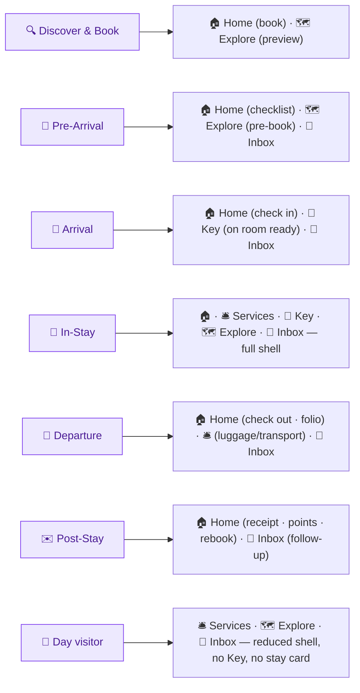
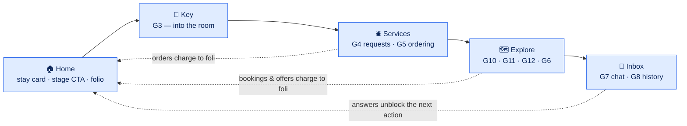

# Atrium Guest — Mobile App Navigation & Feature Map

**Product:** Atrium Guest (Hotel / Resort Guest-Facing Mobile App)
**Document owner:** rdasgupta@apexdmit.com
**Last updated:** 2026-07-16
**Status:** Draft v1.0
**Start here:** [Project Overview & Documentation Index](../overview.md)
**Supporting detail:** [Feature Prioritization](guest-mobile-app-feature-prioritization.md) · [Executive Summary](guest-mobile-app-executive-summary.md) · [Journey-Stage Design](guest-mobile-app-journey-stage-design.md)

This document shows **where each feature is implemented from the mobile app's perspective** — the entry paths, the bottom tab bar, the screens under each tab, and the cross-cutting layers. It is the information-architecture (IA) view, not a visual UI mockup.

> Diagrams below use **Mermaid**. They render in GitHub and in VS Code with a Mermaid preview extension. A text feature-to-screen table follows each diagram as a fallback.

---

## 1. App structure at a glance

The app is a single shell: **Claim stay / Sign in → Home → 5-tab bottom bar**, with **Notifications (G8)**, **Offers surfacing (G6)**, and **App-less parity (G15)** as global layers present on every screen. There is no staff-style RBAC; what the shell shows is driven by **journey stage** and **stay type** (see [Journey-Stage Design](guest-mobile-app-journey-stage-design.md)). The guest can also arrive **app-less** — a QR code or web link (G15) opens the same flows in the browser, no install.

```mermaid
flowchart TB
  E["🎟️ Claim stay / Sign in<br/>booking ref + name · magic link · account · guest-of-guest"]:::auth
  Q["📱 QR / web link (app-less)<br/>G15 — same flows, no install"]:::auth
  E --> BAR{{"📱 Bottom Tab Bar — stage-adaptive"}}:::bar
  Q -.same flows, browser shell.-> BAR

  BELL["🔔 Notifications<br/>global layer · G8"]:::global
  OFR["🎁 Offers surfacing<br/>global layer · G6"]:::global
  APL["🔗 App-less parity<br/>global layer · G15"]:::global
  BELL -.present on every screen.-> BAR
  OFR -.present on every screen.-> BAR
  APL -.every flow linkable.-> BAR

  BAR --> HOME["🏠 Home"]:::tab
  BAR --> SVC["🛎️ Services"]:::tab
  BAR --> KEY["🔑 Key<br/>center tab"]:::tab
  BAR --> EXP["🗺️ Explore"]:::tab
  BAR --> INBOX["💬 Inbox"]:::tab

  %% HOME
  HOME --> H1["Stay card + stage CTA<br/>check in now · room ready · express check-out"]
  HOME --> H2["Quick actions · pre-arrival tasks"]
  HOME --> H3["Folio · payments · tipping"]
  HOME --> H4["Profile · loyalty & points"]
  H1 -.implements.-> G2a["G2 Check-In & Check-Out"]:::feat
  H2 -.implements.-> G1a["G1 Booking & Pre-Arrival"]:::feat
  H3 -.implements.-> G9a["G9 Payments, Folio & Tipping"]:::feat
  H4 -.implements.-> G13a["G13 Loyalty & Guest Profile"]:::feat

  %% SERVICES
  SVC --> S1["Service requests<br/>items · issues+photo · DND · schedule HK"]
  SVC --> S2["Food & beverage<br/>outlet menus · order · track"]
  SVC --> S3["Transport & mobility<br/>airport transfer · shuttle · valet · porter"]
  SVC --> S4["🆘 Emergency assistance<br/>one-tap · critical priority"]
  S1 -.implements.-> G4a["G4 In-Stay Service Requests"]:::feat
  S2 -.implements.-> G5a["G5 F&B Ordering"]:::feat
  S3 -.implements.-> G4a
  S4 -.implements.-> G4a

  %% KEY
  KEY --> K1["Digital room key<br/>unlock · wallet · share · shared doors"]
  K1 -.implements.-> G3a["G3 Digital Room Key"]:::feat

  %% EXPLORE
  EXP --> X1["Guidebook<br/>Wi-Fi · hours · rules · local tips"]
  EXP --> X2["Interactive map<br/>POIs · open/closed · directions"]
  EXP --> X3["Activities · spa · experiences<br/>slots · cabanas/sunbeds · virtual queues · itinerary · events"]
  EXP --> X4["Offers & add-ons gallery"]
  X1 -.implements.-> G10a["G10 Digital Guidebook"]:::feat
  X2 -.implements.-> G11a["G11 Interactive Property Map"]:::feat
  X3 -.implements.-> G12a["G12 Activities, Spa & Experiences"]:::feat
  X4 -.implements.-> G6a["G6 Upsells, Offers & Add-Ons"]:::feat

  %% INBOX
  INBOX --> I1["Chat with the property<br/>auto-translate · WhatsApp/SMS bridge"]
  INBOX --> I2["Notification history"]
  I1 -.implements.-> G7a["G7 Guest Messaging"]:::feat
  I2 -.implements.-> G8a["G8 Notifications & Campaigns"]:::feat

  %% FEEDBACK
  FBK["⭐ Feedback & recovery<br/>pulse prompts · 'something wrong?' · G14"]:::global
  FBK -.surfaced contextually, routes via Inbox.-> INBOX

  classDef auth fill:#1f2a44,color:#fff,stroke:#101828;
  classDef bar fill:#2563eb,color:#fff,stroke:#1e40af;
  classDef tab fill:#e0ecff,color:#0b2559,stroke:#2563eb;
  classDef feat fill:#fef3c7,color:#7a4f01,stroke:#d97706;
  classDef global fill:#dcfce7,color:#14532d,stroke:#16a34a;
```

**Entry paths (no password required for the common case):**

| Path | How | Who it serves |
|------|-----|---------------|
| **Claim stay** | Booking reference + surname, or the magic link in the confirmation email | The typical guest — one tap from the booking email into their stay |
| **Account sign-in** | Email/phone + OTP; profile & loyalty attached (G13) | Returning and loyalty guests |
| **QR / web link (G15)** | Scan a bedside card, table tent, or email QR → the same flow in the browser | The guest who never installs the app — and day visitors |

---

## 2. Feature → screen implementation map (text fallback)

| Feature | Primary location (tab → screen) | Secondary touchpoints |
|---------|--------------------------------|-----------------------|
| **G1 Booking & Pre-Arrival** | 🏠 Home → Book a stay *(pre-reservation)* (room galleries · 360° tours · side-by-side room comparison) · Pre-arrival checklist (registration, documents, arrival time, preferences) | Rebook from Post-Stay Home; add-ons hand off to G6; lands in [staff F2](../../staff/docs/staff-mobile-app-reservations-management-feature.md) |
| **G2 Check-In & Check-Out** | 🏠 Home → stay-card CTA: Check in now / Express check-out (ID scan · signature · payment · room assignment · folio review) | 🔔 "check-in open" / "folio ready" pushes deep-link here; QR path for app-less; lands in [staff F1](../../staff/docs/staff-mobile-app-front-desk-feature.md) |
| **G3 Digital Room Key** | 🔑 Key (center tab) → unlock · wallet key · share with companion · shared doors | Issued by G2 flow; 🔔 "room ready" push; hidden until issued |
| **G4 In-Stay Service Requests** | 🛎️ Services → Requests (items · issue+photo · schedule HK · DND · green opt-out · lost item · live status) · Transport (airport transfer with driver tracking · shuttle live location · valet retrieval · porter) · 🆘 Emergency assistance (one-tap · critical priority) | Raise from chat (G7) and map/guidebook context; lands in [staff F5](../../staff/docs/staff-mobile-app-task-management-communication-feature.md); emergencies route via the staff SOS pipeline (F16) |
| **G5 F&B Ordering** | 🛎️ Services → Food & Beverage (menus · dietary filters · deliver to room/location · order status) | 🗺️ Explore map → tap restaurant → menu; QR at table (G15); lands in [staff F8 POS](../../staff/docs/staff-mobile-app-pos-multi-outlet-feature.md) |
| **G6 Upsells, Offers & Add-Ons** | *Global layer* + 🗺️ Explore → Offers gallery | Home stay card (upgrade / late check-out), G2 check-in step, G1 booking add-ons, G8 campaign pushes |
| **G7 Guest Messaging** | 💬 Inbox → Chat (one thread · auto-translate · WhatsApp/SMS bridge) | "Message us" entry on every service screen; feedback recovery threads (G14) |
| **G8 Notifications & Campaigns** | *Global layer* + 💬 Inbox → Notification history · preferences | Deep-links into G2/G3/G5/G9/G12 screens; stage-gated (see [Journey-Stage Design](guest-mobile-app-journey-stage-design.md)) |
| **G9 Payments, Folio & Tipping** | 🏠 Home → Folio (live itemized bill · pay deposit/interim/final · bKash/Nagad/SSLCommerz + cards · split/email receipt) · Split & group billing (per-person payment links · organizer controls · consolidated group invoice) · Tip | G2 check-out settle step; G5 direct payment; QR tipping app-less (G15) |
| **G10 Digital Guidebook** | 🗺️ Explore → Guidebook (Wi-Fi one-touch · hours · amenities · rules · transport · prayer times · local tips; offline; Bangla/English) | Searchable from Home; auto-answers feed G7 chat |
| **G11 Interactive Property Map** | 🗺️ Explore → Map (POIs · live open/closed · pin photo previews · walking directions) | Tap-through: restaurant → G5 menu · spa → G12 booking · cabana/sunbed → G12 booking · event → schedule |
| **G12 Activities, Spa & Experiences** | 🗺️ Explore → Activities & Spa (slots · live capacity · reserve & pay/charge · cabana & sunbed booking · virtual queue/waitlist — join · live position · table-ready alert · my itinerary · event schedule) | Pre-book from Pre-Arrival Home; cabanas/sunbeds picked from the map (G11); 🔔 reminders; lands in [staff F18](../../staff/docs/staff-mobile-app-events-activities-feature.md) |
| **G13 Loyalty & Guest Profile** | 🏠 Home → Profile (preferences · points & tier · redeem rewards) · My group (companion invites · scoped access · shared group itinerary) | Personalizes G6 targeting and Explore content; sign-in path at entry |
| **G14 Feedback & Service Recovery** | *Contextual prompts* + 💬 Inbox → "Something wrong?" · issue status | Smart-moment pulse ratings; post-checkout review invite; lands in [staff F14](../../staff/docs/staff-mobile-app-guest-feedback-service-recovery-feature.md) |
| **G15 App-less Access** | *Cross-cutting channel, not a screen* — every flow above served as a QR/web link | Booking email, bedside card, table tent, folio QR, tip QR; native app = upgrade path |

**Cross-cutting (every screen):** 🔔 Notifications (G8) · 🎁 Offers surfacing (G6) · 🔗 App-less parity (G15) · language toggle (Bangla/English + guest language) · stay context (reservation, room, folio).

---

## 3. Stage-based navigation (what surfaces at each journey stage)

The guest app has no roles; the shell adapts to **journey stage** (reservation state + date + check-in state) and **stay type**. The full feature×stage matrix, detection rules, and hard visibility rules live in [Journey-Stage Design](guest-mobile-app-journey-stage-design.md) — this is the navigation summary.

| Tab / surface | Discover & Book | Pre-Arrival | Arrival | In-Stay | Departure | Post-Stay | Day visitor |
|---------------|:---:|:---:|:---:|:---:|:---:|:---:|:---:|
| 🏠 Home (stay card + stage CTA) | ✅ book | ✅ checklist | ✅ check-in CTA | ✅ launcher | ✅ check-out CTA | ✅ receipt · rebook | — |
| 🛎️ Services (G4 · G5) | — | ◐ pre-order / standing requests | ◐ | ✅ | ◐ luggage · transport | — | ✅ (G5 only) |
| 🔑 Key (G3) | — | — | ✅ *on room ready* | ✅ | ◐ expires at check-out | — | — |
| 🗺️ Explore (G10 · G11 · G12 · G6) | ◐ preview | ✅ pre-book | ✅ | ✅ | ◐ | — | ✅ (map · day-use) |
| 💬 Inbox (G7 · G8) | ◐ | ✅ | ✅ | ✅ | ✅ | ◐ follow-up | ✅ (order-scoped chat · status alerts) |
| Folio & payments (G9, via Home) | ◐ deposit | ◐ | ◐ | ✅ | ✅ settle | ◐ receipt | — *(pay-per-order only)* |
| Offers layer (G6) | ◐ booking add-ons | ✅ | ✅ upgrade | ✅ | ◐ late check-out | — | ◐ day-use |

*Legend: ✅ primary · ◐ limited · — not surfaced. **Day visitors get the reduced three-tab shell** (Services · Explore · Inbox): no Key, no stay card, no folio — G5 orders and G12 day-use bookings settle by direct payment (G9's payment rails without the folio).*

---

## 4. How the tabs map to the guest journey

The tabs mirror the stay loop: **arrive and settle (Home) → consume (Services) → move (Key) → discover and spend (Explore) → talk (Inbox)** — with Home re-centering on whatever the current stage needs.

- **Home → Key:** check-in completes, room-ready fires, the key issues — the arrival arc ends in the center tab.
- **Key → Services:** in the room, consumption starts — towels, dinner, DND.
- **Services / Explore → Home:** every order, booking, and accepted offer posts to the folio the guest watches on Home — transparency is the anti-dispute mechanism (G9).
- **Explore → Services:** the map is a menu of menus — tap a restaurant, order (G5); tap the spa, book (G12).
- **Inbox everywhere:** chat rides alongside every stage; notifications deep-link back into the tab that needs action.

---

## 5. Key guest journeys (screen path)

**Arrival (leisure guest, app installed):**
`🔔 "check-in open" push → 🏠 Home / stay card → Check in (ID scan · signature · balance) → upsell prompt (G6) → done → 🔔 "room ready" push → 🔑 Key issued → unlock`

**Dinner by the pool (in-stay):**
`🗺️ Explore / map → tap pool bar (G11) → menu (G5) → order → charge to room (G9) → 🔔 "on its way" → track in 🛎️ Services`

**Something's wrong (service recovery):**
`🛎️ Services → report issue + photo (G4) → routed to staff (F5) with SLA timer → status updates in-app → pulse prompt (G14) → resolved before checkout`

**Departure (express check-out):**
`🔔 "folio ready" push (departure morning) → 🏠 Home / folio review (G9) → settle via bKash / card → e-receipt emailed → key expires (G3) → 🔔 review invite (G14)`

**App-less guest (never installed, G15):**
`Confirmation email magic link → browser check-in (G2) → bedside QR → guidebook + menu (G10/G5) → table-tent QR → order + pay via SSLCommerz (G9) → folio link at checkout → tip QR at departure`

**Day visitor:**
`Pool-gate QR (G15) → reduced shell → 🗺️ Explore / day-use booking (G12) → 🛎️ order lunch (G5) → pay direct (bKash) → ⭐ quick rating (G14)`

---

## 6. Features on the navigation shell

Atrium Guest ships as **one complete package** — every feature and its screens are present from launch; the *stage*, not the release plan, decides what a guest sees. The map below groups the features by theme and shows where each lives on the shell (themes align to the [Feature Prioritization](guest-mobile-app-feature-prioritization.md)).

| Theme | Tabs/screens | Features |
|-------|--------------|----------|
| **Revenue engines** | 🎁 Offers layer (global) + 🗺️ Explore (Offers gallery); 🛎️ Services (F&B) | G6, G5 |
| **Journey spine** | 🏠 Home (book · pre-arrival checklist · stage CTAs), 🔑 Key (center tab) | G1, G2, G3 |
| **Money layer** | 🏠 Home (Folio · payments · tipping); settle steps inside G2/G5/G12 | G9 |
| **Glue** | 🔔 Global layer + 💬 Inbox (history · preferences) | G8 |
| **Self-service core** | 🛎️ Services (Requests), 💬 Inbox (Chat) | G4, G7 |
| **Resort upside** | 🗺️ Explore (Map · Activities & Spa) | G11, G12 |
| **Deflection** | 🗺️ Explore (Guidebook) | G10 |
| **Retention** | 🏠 Home (Profile · loyalty); contextual prompts + 💬 Inbox | G13, G14 |
| **Cross-cutting enabler** | 🔗 Every flow served as QR/web link — booking email, bedside card, table tent, folio & tip QR — never its own screen | G15 |

---

## 7. Notes

- **One shell, stage-adaptive.** The five tabs are fixed; stage and stay type decide which are active and what Home shows. Day visitors get the reduced three-tab shell.
- **Home is a stay card, not a dashboard.** One card, one stage-correct CTA, quick actions, folio access — the guest analog of the staff launcher.
- **Key is the center tab** — the highest-frequency in-stay action gets the thumb position; it stays hidden/disabled until a key is actually issued (hard rule, see [Journey-Stage Design](guest-mobile-app-journey-stage-design.md)).
- **Notifications, offers, and app-less are layers, not tabs.** They wrap every screen rather than living in one place.
- **Charge-to-folio is the connective thread.** G5 orders, G12 bookings, and G6 acceptances post to the same live folio (G9) the guest reviews at check-out — the guest-side mirror of staff charge-to-room.
- **Every action lands in Atrium Staff:** G4→[F5](../../staff/docs/staff-mobile-app-task-management-communication-feature.md) · G5→[F8](../../staff/docs/staff-mobile-app-pos-multi-outlet-feature.md) · G12→[F18](../../staff/docs/staff-mobile-app-events-activities-feature.md) · G14→[F14](../../staff/docs/staff-mobile-app-guest-feedback-service-recovery-feature.md) · G2→[F1](../../staff/docs/staff-mobile-app-front-desk-feature.md) · G1→[F2](../../staff/docs/staff-mobile-app-reservations-management-feature.md).
- **Vendor precedent** for this shell shape (stay card + services + key + explore + inbox): INTELITY, Mews, Duve, IDS Next FX Club App, and the resort specialists (Nonius, Attractions.io) — see the [competitive research, Part A](../../HOTEL-~1.MD).
- This is the **IA/navigation** view. A visual phone-frame mockup can be produced as a shareable Artifact on request.
